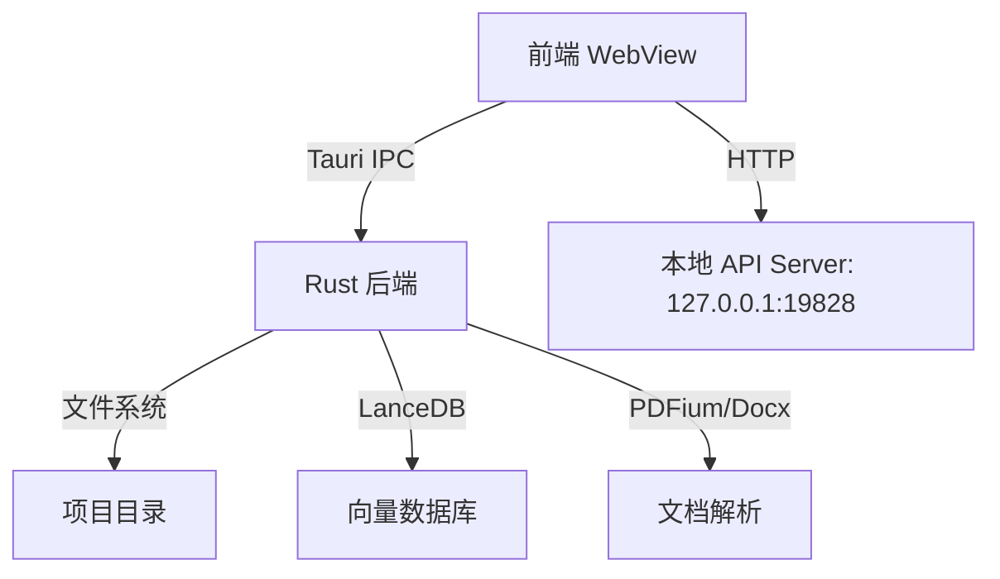
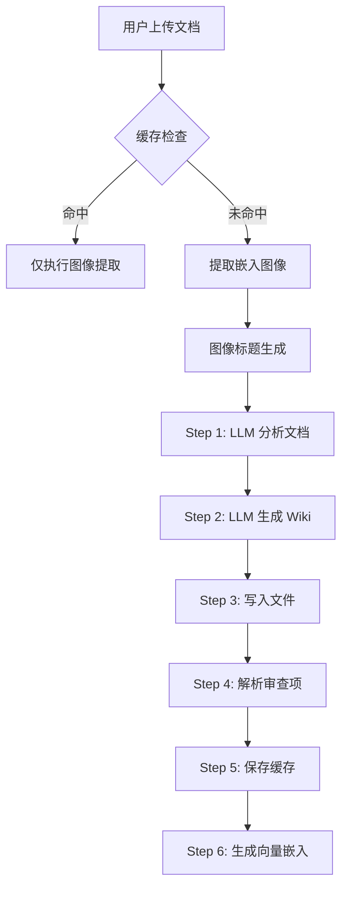

# LLM Wiki 项目分析报告

## 一、技术栈

| 类别 | 技术 | 版本 |
|-----|------|------|
| **前端框架** | React 19 | ^19.0.0 |
| **构建工具** | Vite 8 | ^8.0.0 |
| **类型系统** | TypeScript | ^5.7.3 |
| **状态管理** | Zustand | ^5.0.12 |
| **样式框架** | TailwindCSS 4 | ^4.2.2 |
| **图标库** | Lucide React | ^1.7.0 |
| **知识图谱** | Graphology + Sigma | graphology@^0.26.0, sigma@^3.0.2 |
| **桌面框架** | Tauri 2 | ^2.11.0 |
| **后端语言** | Rust | 2021 Edition |
| **数据库** | LanceDB | ^0.27.2 |
| **测试框架** | Vitest | ^4.1.4 |

---

## 二、项目结构

```
llm_wiki/
├── .github/workflows/     # CI/CD 配置
├── assets/                # 宣传图片资源
├── extension/             # Chrome 浏览器扩展
├── mcp-server/            # MCP (Model Context Protocol) 服务器
├── plans/                 # 功能规划文档
├── protoc/                # Protocol Buffers 编译器
├── scripts/               # 辅助脚本
├── src/                   # 前端源代码
│   ├── assets/            # 应用资源
│   ├── commands/          # Tauri 命令封装
│   ├── components/        # React 组件
│   │   ├── chat/          # 聊天面板
│   │   ├── editor/        # Wiki 编辑器
│   │   ├── graph/         # 知识图谱视图
│   │   ├── layout/        # 布局组件
│   │   ├── lint/          # Lint 检查视图
│   │   ├── project/       # 项目管理
│   │   ├── review/        # 审查视图
│   │   ├── search/        # 搜索视图
│   │   ├── settings/      # 设置面板
│   │   ├── sources/       # 源文件管理
│   │   └── ui/            # 基础 UI 组件
│   ├── i18n/              # 国际化支持
│   ├── lib/               # 核心业务逻辑
│   ├── stores/            # Zustand 状态存储
│   ├── test-helpers/      # 测试辅助工具
│   ├── types/             # TypeScript 类型定义
│   ├── App.tsx            # 应用主组件
│   ├── main.tsx           # 应用入口
│   └── index.css          # 全局样式
└── src-tauri/             # Tauri 后端
    ├── capabilities/      # 权限配置
    ├── icons/             # 应用图标
    ├── pdfium/            # PDF 解析库
    └── src/               # Rust 源代码
        ├── commands/      # Tauri 命令实现
        └── types/         # Rust 类型定义
```

---

## 三、文件职责矩阵

| 文件 | 层级 | 核心职责 |
|-----|------|---------|
| `src/main.tsx` | 入口 | 应用初始化、主题加载、错误处理 |
| `src/App.tsx` | 核心 | 主应用组件、项目状态管理、生命周期 |
| `src/stores/wiki-store.ts` | 状态 | 全局状态管理（项目、配置、视图） |
| `src/stores/chat-store.ts` | 状态 | 聊天记录管理 |
| `src/stores/review-store.ts` | 状态 | 审查项管理 |
| `src/lib/ingest.ts` | 业务 | 文档导入核心逻辑（分析 + 生成） |
| `src/lib/llm-client.ts` | 业务 | LLM 客户端封装（流式响应） |
| `src/lib/llm-providers.ts` | 业务 | LLM 提供商配置（OpenAI/Anthropic/Ollama 等） |
| `src/lib/embedding.ts` | 业务 | 向量嵌入处理 |
| `src/lib/search.ts` | 业务 | 混合搜索（关键词 + 向量） |
| `src/lib/deep-research.ts` | 业务 | 深度研究功能 |
| `src-tauri/src/api_server.rs` | 后端 | 本地 HTTP API 服务 |
| `src-tauri/src/main.rs` | 后端 | Tauri 应用入口 |
| `src-tauri/src/commands/` | 后端 | 文件操作、搜索、向量存储命令 |

---

## 四、核心架构设计

### 4.1 双端架构



### 4.2 文档导入流程 (Ingest Pipeline)



### 4.3 LLM 支持架构

| 提供商 | 协议 | 说明 |
|-------|------|------|
| OpenAI | Chat Completions | 标准 API |
| Anthropic | Messages | Claude 系列 |
| Google Gemini | Native API | 原生格式 |
| Azure | OpenAI 兼容 | 部署端点 |
| Ollama | Local API | 本地模型 |
| Claude Code | CLI 子进程 | 本地 Claude CLI |
| Codex CLI | CLI 子进程 | 代码解释器 |
| Custom | 自定义端点 | 通用兼容 |

---

## 五、代码质量评估

### 优点

1. **完善的测试覆盖**：核心模块都有对应的测试文件（`.test.ts`），支持 mock 测试和真实 LLM 测试分离
2. **类型安全**：全面使用 TypeScript，状态管理有完整的类型定义
3. **模块化设计**：业务逻辑与 UI 组件清晰分离，lib/ 目录职责明确
4. **错误处理**：完善的异常捕获和错误提示机制
5. **缓存策略**：基于内容哈希的增量缓存，避免重复处理
6. **安全防护**：路径遍历防护（`isSafeIngestPath`）、API 认证机制

### 待改进

1. **长文件问题**：`ingest.ts` 超过 1500 行，可考虑拆分多个模块
2. **错误边界**：部分文件缺少完整的错误处理覆盖
3. **文档完善**：核心模块缺少 README 文档说明

---

## 六、扩展建议

### 短期

- 添加更多 LLM 提供商支持（如 DeepSeek、Moonshot 等）
- 增强知识图谱可视化交互能力
- 优化大文档处理性能

### 中期

- 添加团队协作功能（多人编辑）
- 支持更多文档格式（EPUB、MOBI 等）
- 实现文档版本控制

### 长期

- 云端同步与备份
- 移动端适配
- AI 代理自动化工作流

---

## 七、API 端点清单

| 端点 | 方法 | 描述 |
|-----|------|------|
| `/api/v1/health` | GET | 健康检查 |
| `/api/v1/projects` | GET | 项目列表 |
| `/api/v1/projects/{id}/files` | GET | 文件列表 |
| `/api/v1/projects/{id}/files/content` | GET | 文件内容 |
| `/api/v1/projects/{id}/reviews` | GET | 审查项列表 |
| `/api/v1/projects/{id}/search` | POST | 混合搜索 |
| `/api/v1/projects/{id}/graph` | GET | 知识图谱数据 |
| `/api/v1/projects/{id}/sources/rescan` | POST | 重新扫描源文件 |

---

## 八、关键配置项

### LLM 配置 (`LlmConfig`)

```typescript
{
  provider: "openai" | "anthropic" | "google" | "azure" | "ollama" | "custom",
  apiKey: string,
  model: string,
  maxContextSize: number,      // 最大上下文窗口（字符数）
  reasoning?: {                // 推理模式配置
    mode: "auto" | "off" | "low" | "medium" | "high" | "max"
  }
}
```

### 搜索配置 (`SearchApiConfig`)

```typescript
{
  provider: "tavily" | "serpapi" | "searxng" | "ollama" | "none",
  deepResearchSource: "web" | "anytxt" | "both"  // 深度研究数据源
}
```

---

## 九、安全特性

| 特性 | 说明 |
|-----|------|
| **路径遍历防护** | `isSafeIngestPath` 校验，禁止访问 wiki/ 目录外的文件 |
| **API 认证** | Bearer Token + X-LLM-Wiki-Token 双认证方式 |
| **请求限流** | 每秒 120 请求限制，最大 64 并发 |
| **请求超时** | 30 分钟长超时，区分用户取消和真正超时 |
| **CORS 配置** | 允许所有来源，限制允许的 Header |

---

**报告生成时间**: 2024年  
**项目版本**: v0.4.24